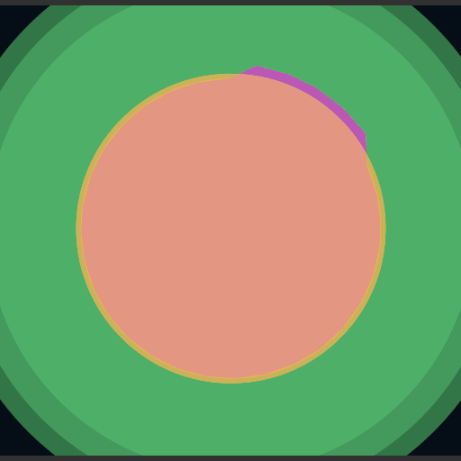

# Procedural-2D-Planets

This generator creates unique planets using realistic plate tectonics behaviour. 

Planets are created with values for temperature, water level, age and volcanic activity. All these parameters are used to simulate the movement of plate tectonics that can result in chains of mountains, valley rifts, volcanoes, hills, depressions and underwater volcanoes.

This project also can generate biomes taking in account temperature, elevation and moisture.

